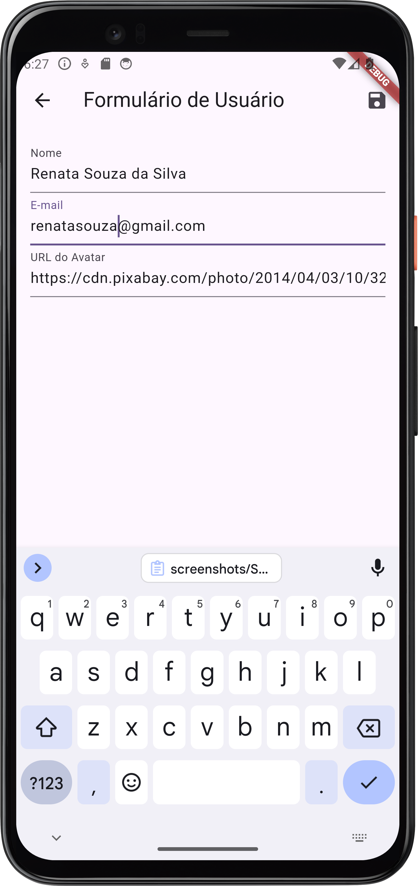
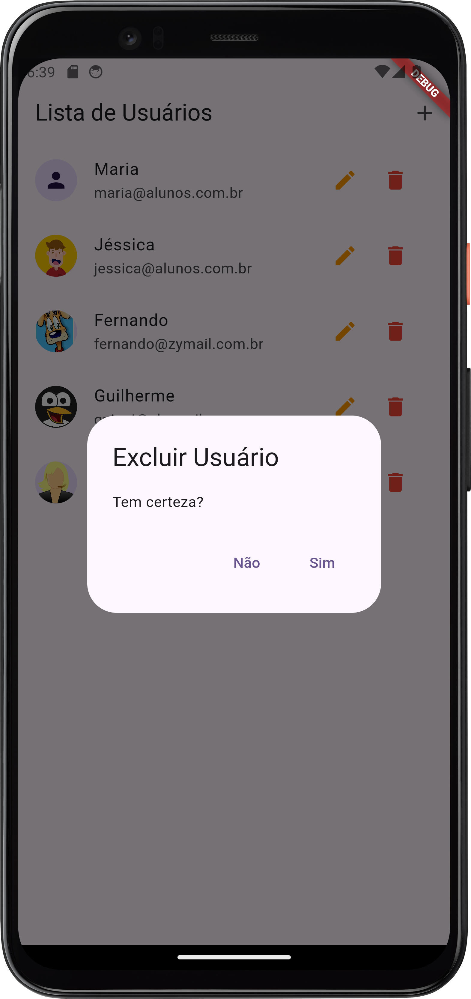

# App CRUD de Usuários utilizando Flutter

Este aplicativo demonstra a criação, leitura, atualização e exclusão (CRUD) de dados de usuários com o uso de Flutter.

## Visão Geral

Este aplicativo foi desenvolvido para demonstrar a implementação de operações CRUD em um aplicativo Flutter utilizando o `Provider` para gerenciamento de estado e `ChangeNotifier` para notificações de mudanças.

## Funcionalidades

- **Adicionar Usuário**: Permite adicionar um novo usuário com nome, e-mail e URL do avatar.
- **Listar Usuários**: Exibe uma lista de todos os usuários cadastrados.
- **Editar Usuário**: Permite editar as informações de um usuário existente.
- **Excluir Usuário**: Permite excluir um usuário da lista.

## Screenshots

### Tela Inicial | Lista de Usuários


### Formulário de Usuário


### Adicionando Novo Usuário 'Renata'


### Novo Usuário 'Renata' Salvo


### Editando Usuário 'Renata'


### Usuário 'Renata' Salvo


### Deletando Usuário 'Guilherme'


### Usuário 'Guilherme' Deletado


## Como Executar

Para executar este projeto localmente, siga os passos abaixo:

1. **Clone o repositório:**

    ```bash
    git clone https://github.com/fernandogabrieu/crud-flutter.git
    ```

2. **Navegue até o diretório do projeto:**

    ```bash
    cd crud-flutter
    ```

3. **Instale as dependências:**

    ```bash
    flutter pub get
    ```

4. **Execute o aplicativo:**

    ```bash
    flutter run
    ```

## Tecnologias Utilizadas

- [Flutter](https://flutter.dev/)
- [Provider](https://pub.dev/packages/provider)
- [Android Studio](https://developer.android.com/studio) (versão Koala)

## Possíveis Melhorias

- **Integração com Firebase**: Armazenar os dados dos usuários em um banco de dados Firebase.
- **Upload de Imagens**: Permitir que os usuários façam upload de imagens para seus avatares.
- **Internacionalização**: Adicionar suporte a múltiplos idiomas para tornar o aplicativo acessível a nível global.
- **Testes Automatizados**: Adicionar testes automatizados para garantir a qualidade do código.

---

Desenvolvido por [Fernando Gabriel](https://github.com/fernandogabrieu)